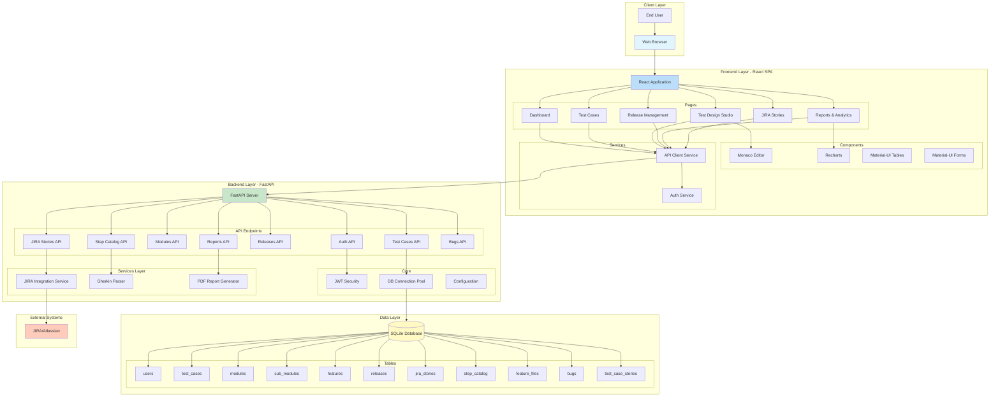
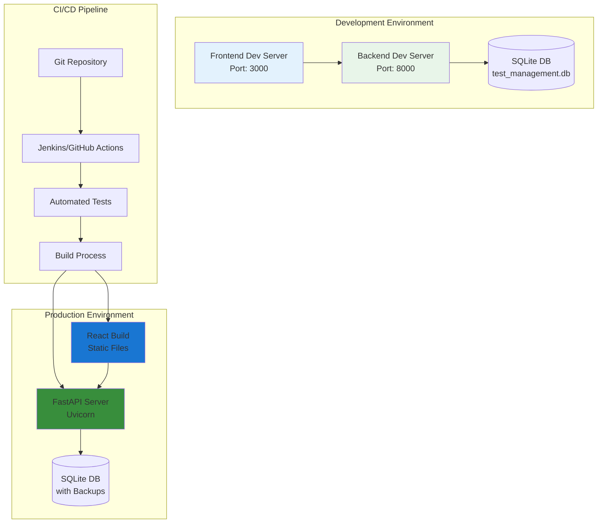
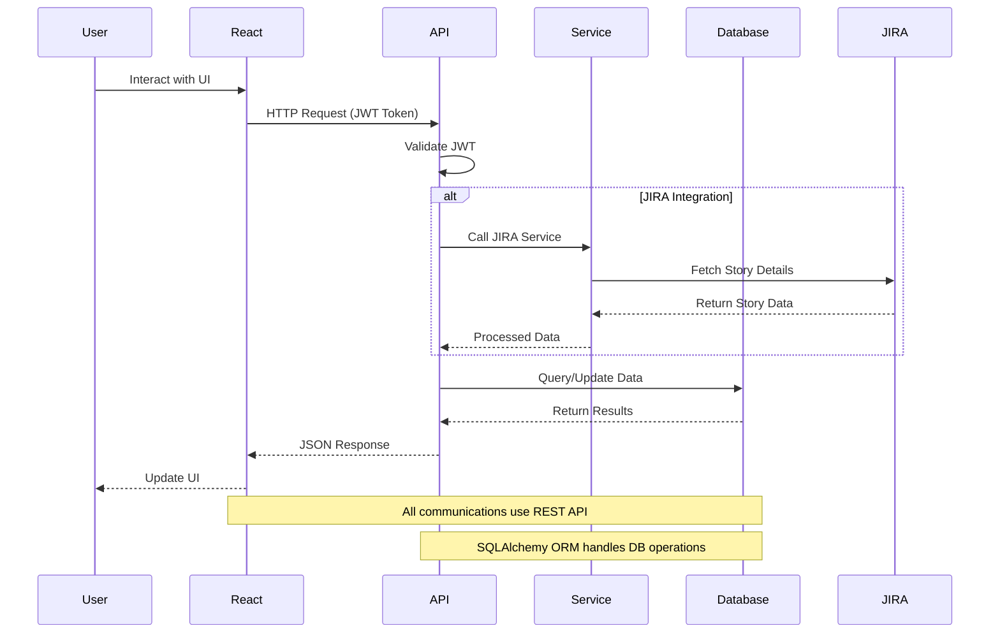
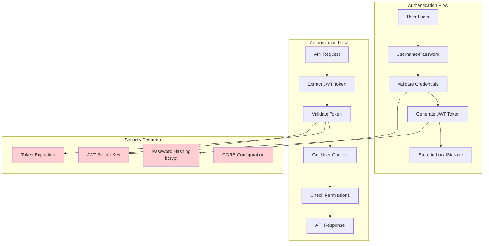
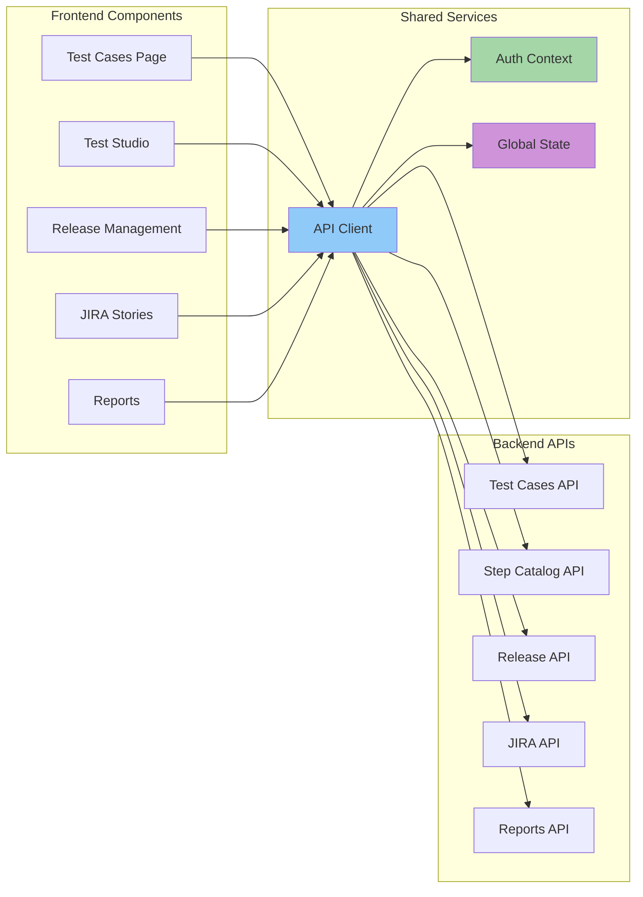

# System Architecture Diagram

## High-Level Architecture

## Technology Stack Details

```mermaid
graph LR
    subgraph "Frontend Stack"
        React[React 18]
        MUI[Material-UI v5]
        Monaco[Monaco Editor]
        Recharts[Recharts]
        Axios[Axios]
    end
    
    subgraph "Backend Stack"
        Python[Python 3.13]
        FastAPI[FastAPI]
        SQLAlchemy[SQLAlchemy ORM]
        Uvicorn[Uvicorn Server]
        JWT[JWT Auth]
        Gherkin[Gherkin Parser]
    end
    
    subgraph "Database"
        SQLite[SQLite 3]
    end
    
    subgraph "Testing"
        Pytest[Pytest]
        Selenium[Selenium]
        Requests[Requests]
        PyMySQL[PyMySQL]
    end
    
    React --> MUI
    React --> Monaco
    React --> Recharts
    React --> Axios
    
    Python --> FastAPI
    FastAPI --> SQLAlchemy
    FastAPI --> Uvicorn
    FastAPI --> JWT
    FastAPI --> Gherkin
    
    SQLAlchemy --> SQLite
    
    style React fill:#61dafb
    style FastAPI fill:#009688
    style SQLite fill:#003b57
```

## Deployment Architecture

## Data Flow Architecture

## Security Architecture

## Component Communication

