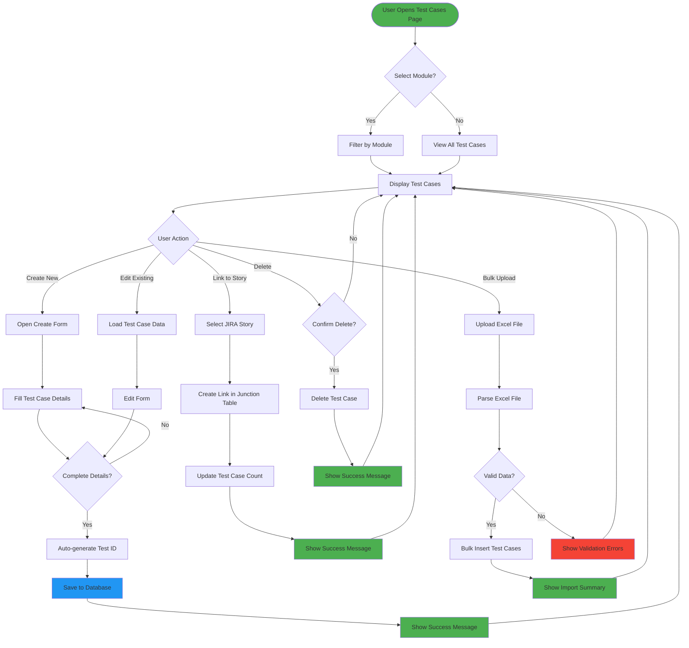
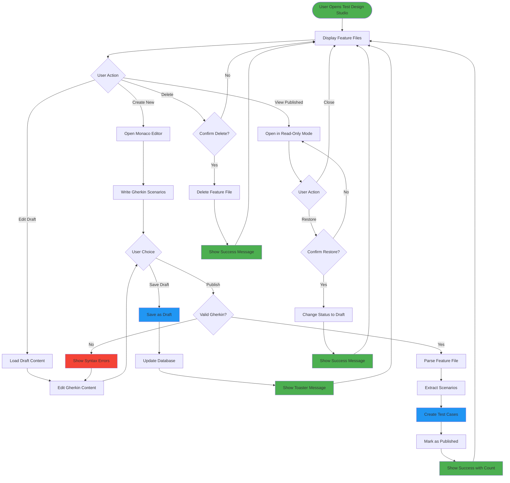
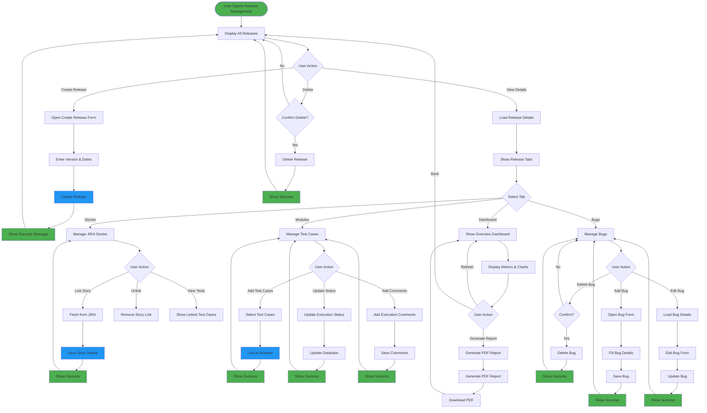
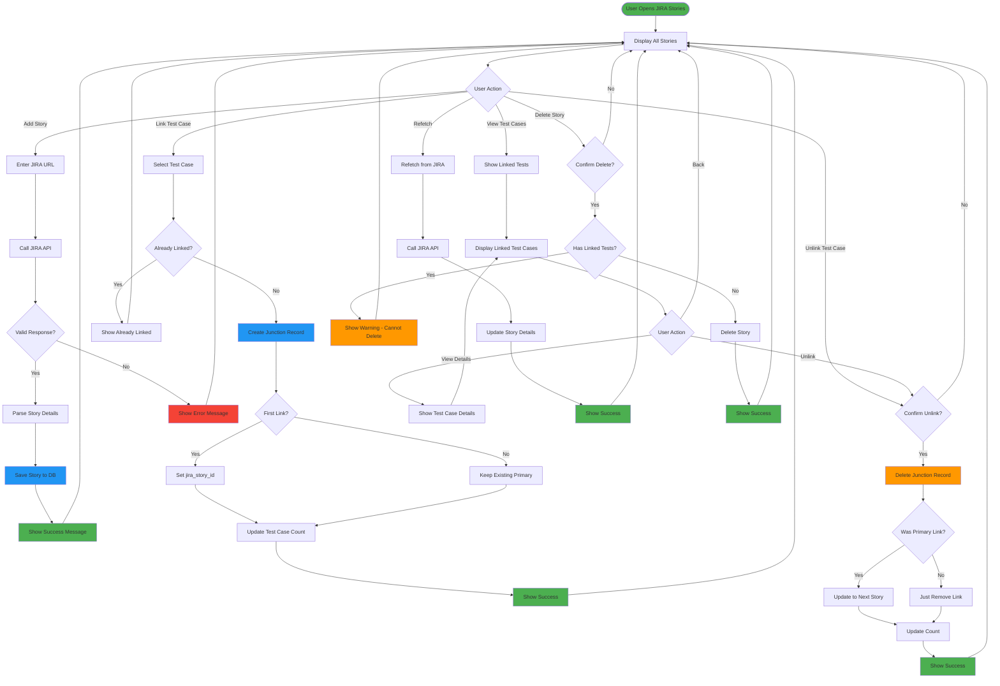
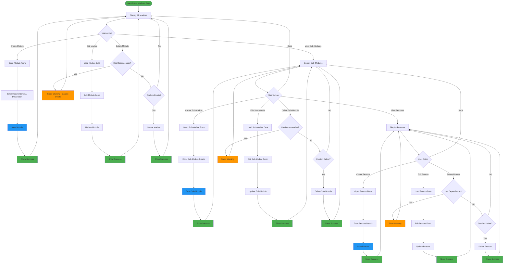
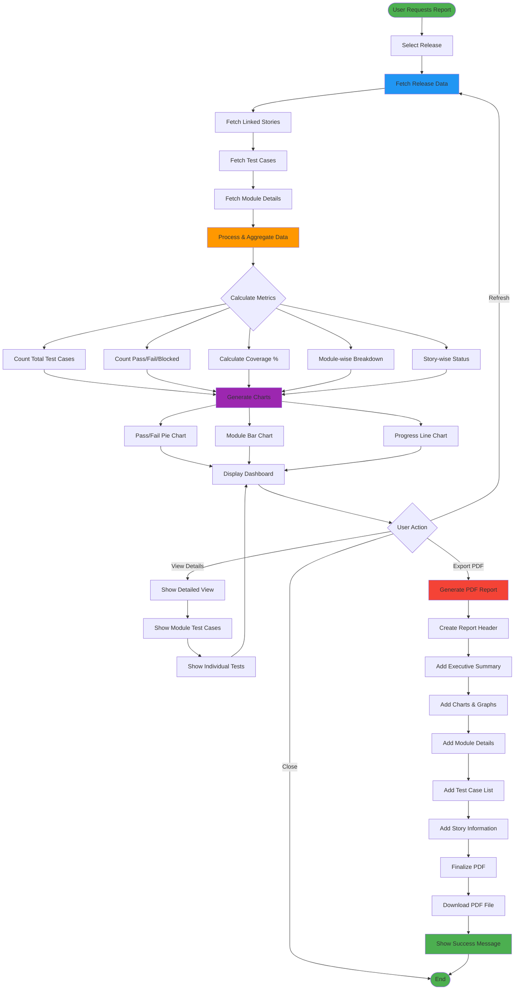

# Feature Flow Diagrams

## 1. Test Case Creation Flow

## 2. Test Design Studio Flow (Gherkin/BDD)

## 3. Release Management Flow

## 4. JIRA Stories Integration Flow

## 5. Module & Sub-Module Management Flow

## 6. Report Generation Flow

