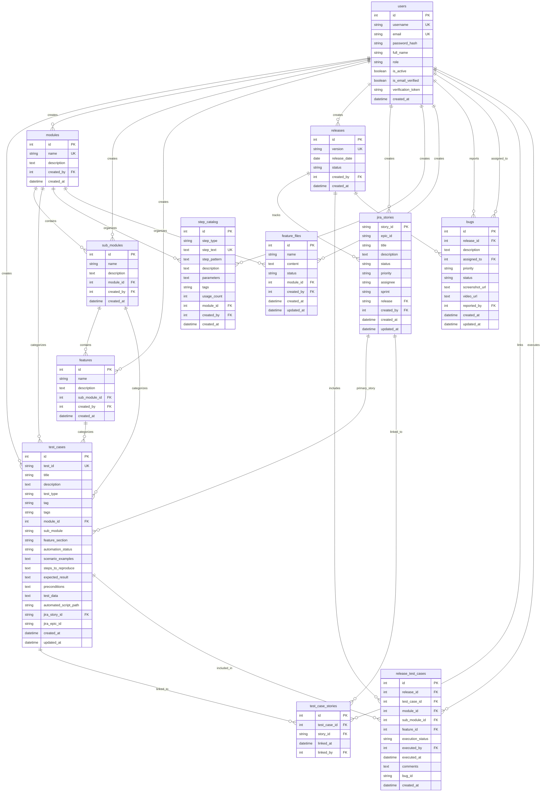

# Database Schema Diagram

## Complete Entity Relationship Diagram

## Core Tables Detail

### 1. Users Table

**Purpose**: User authentication and authorization  
**Indexes**: username, email  
**Constraints**: Unique on username and email

### 2. Test Cases Table

**Purpose**: Central repository for all test cases  
**Indexes**: test_id, module_id, jira_story_id, tag, test_type  
**Unique**: test_id

### 3. Many-to-Many Junction Table

**Purpose**: Many-to-many relationship between test cases and JIRA stories  
**Indexes**: test_case_id, story_id  
**Unique Constraint**: (test_case_id, story_id)

## Module Hierarchy

## Release Management Schema

## BDD/Gherkin Schema

## Indexes and Performance

## Data Relationships Summary

## Migration History

