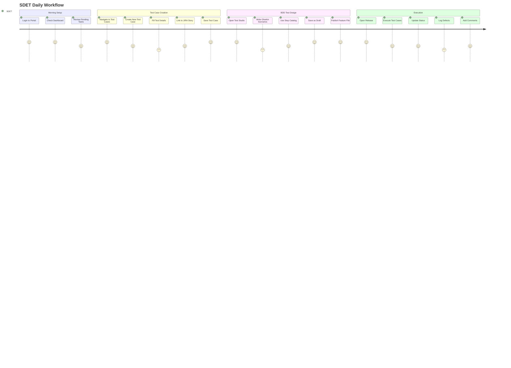
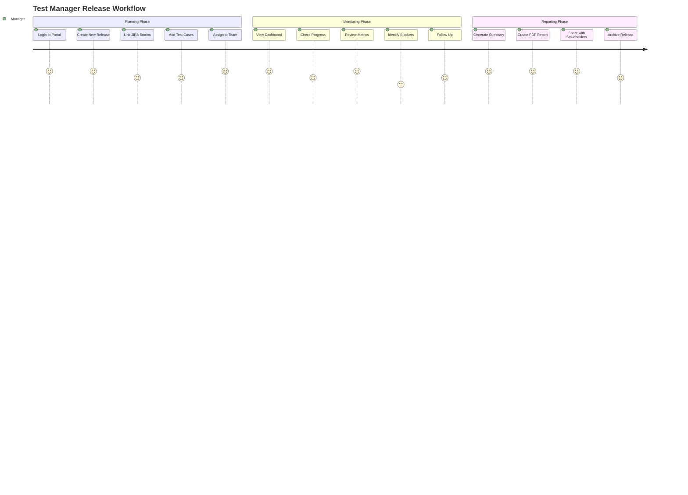
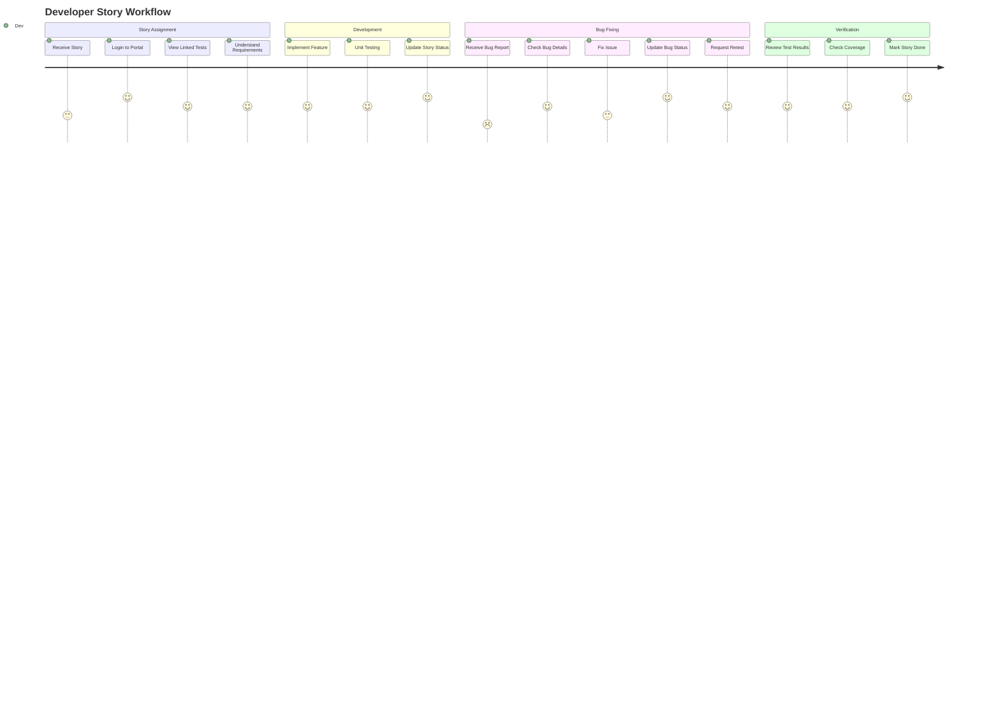
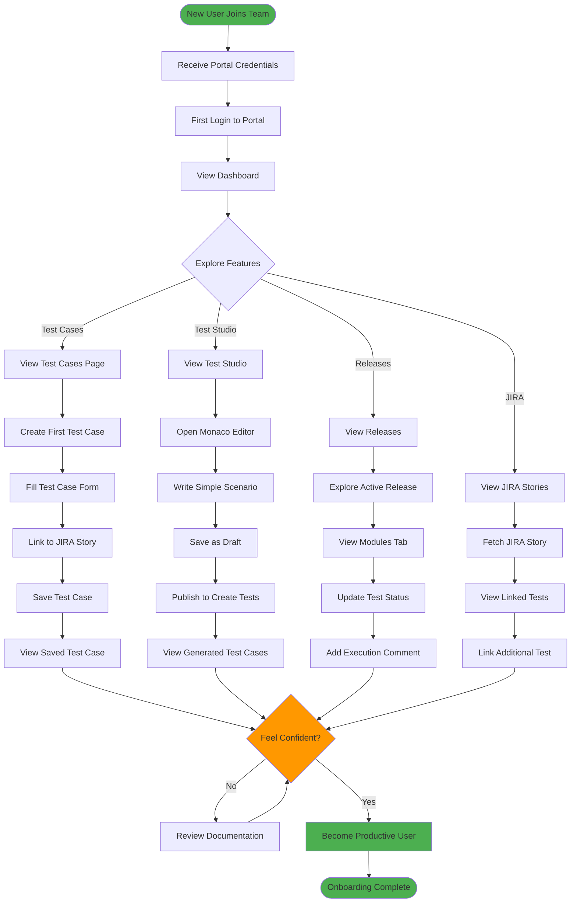
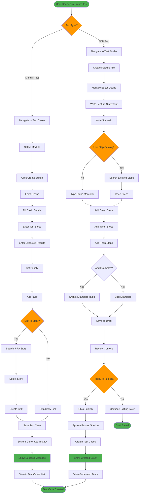
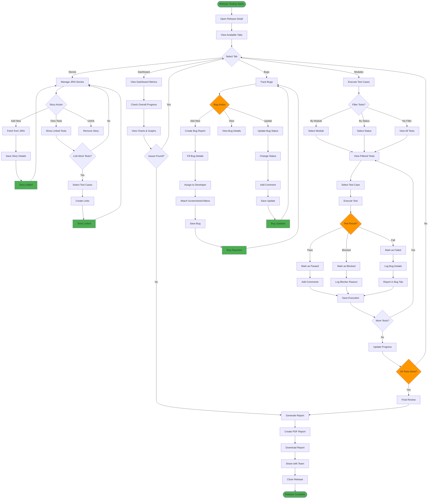
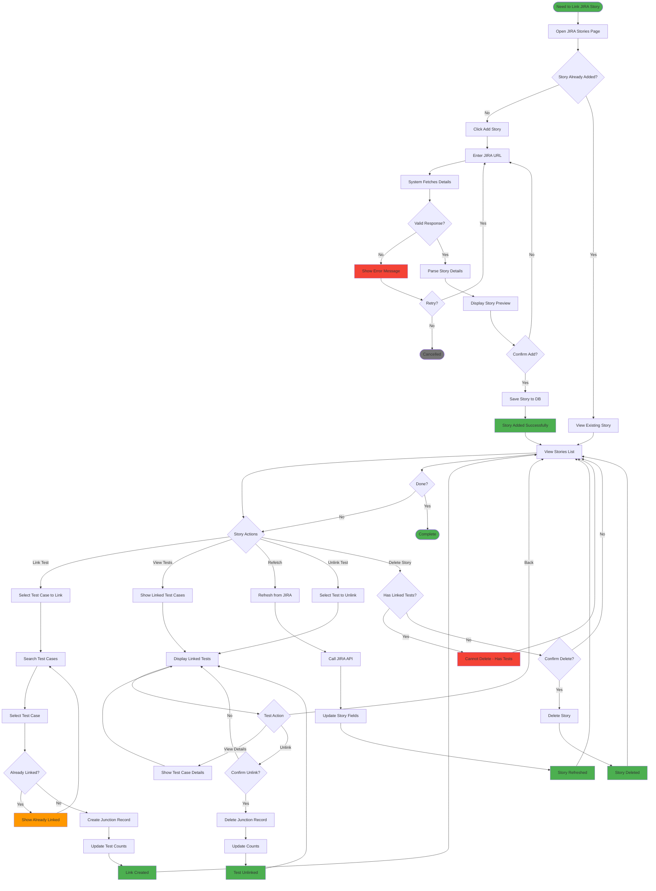
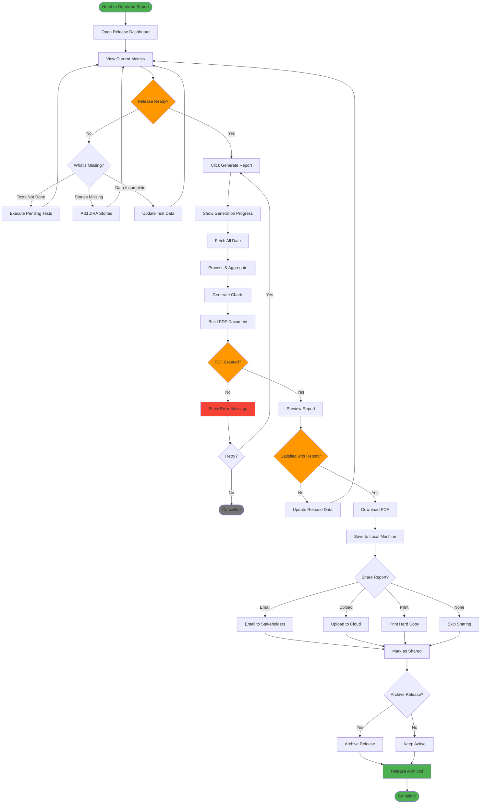

# User Journey Flowcharts

## 1. SDET User Journey - Complete Test Case Lifecycle

## 2. Test Manager Journey - Release Planning & Tracking

## 3. Developer Journey - Bug Fixing & Story Completion

## 4. New User Onboarding Journey

## 5. Test Case Creation User Journey (Detailed)

## 6. Release Execution User Journey

## 7. JIRA Integration User Journey

## 8. Report Generation User Journey

