# API Architecture Diagram

## Complete API Endpoint Map

```mermaid
graph TB
    subgraph "Client Applications"
        WebApp[React Web Application]
        Mobile[Mobile App - Future]
        CLI[CLI Tool - Future]
    end
    
    subgraph "API Gateway / FastAPI Server"
        Gateway[FastAPI Application<br/>Port: 8000]
    end
    
    subgraph "Authentication & Authorization"
        AuthEndpoints["/api/auth/*"]
        Login[POST /login]
        Register[POST /register]
        Verify[POST /verify-email]
        Me[GET /me]
        
        AuthEndpoints --> Login
        AuthEndpoints --> Register
        AuthEndpoints --> Verify
        AuthEndpoints --> Me
    end
    
    subgraph "User Management"
        UserEndpoints["/api/users/*"]
        GetUsers[GET /users]
        GetUser[GET /users/:id]
        UpdateUser[PUT /users/:id]
        DeleteUser[DELETE /users/:id]
        
        UserEndpoints --> GetUsers
        UserEndpoints --> GetUser
        UserEndpoints --> UpdateUser
        UserEndpoints --> DeleteUser
    end
    
    subgraph "Test Cases Management"
        TCEndpoints["/api/test-cases/*"]
        GetAllTC[GET /test-cases]
        GetTC[GET /test-cases/:id]
        CreateTC[POST /test-cases]
        UpdateTC[PUT /test-cases/:id]
        DeleteTC[DELETE /test-cases/:id]
        BulkUploadTC[POST /test-cases/bulk-upload]
        ExportTC[GET /test-cases/export]
        
        TCEndpoints --> GetAllTC
        TCEndpoints --> GetTC
        TCEndpoints --> CreateTC
        TCEndpoints --> UpdateTC
        TCEndpoints --> DeleteTC
        TCEndpoints --> BulkUploadTC
        TCEndpoints --> ExportTC
    end
    
    subgraph "Module Management"
        ModEndpoints["/api/modules/*"]
        GetModules[GET /modules]
        GetModule[GET /modules/:id]
        CreateModule[POST /modules]
        UpdateModule[PUT /modules/:id]
        DeleteModule[DELETE /modules/:id]
        GetSubModules[GET /modules/:id/sub-modules]
        CreateSubModule[POST /modules/:id/sub-modules]
        GetFeatures[GET /sub-modules/:id/features]
        CreateFeature[POST /sub-modules/:id/features]
        
        ModEndpoints --> GetModules
        ModEndpoints --> GetModule
        ModEndpoints --> CreateModule
        ModEndpoints --> UpdateModule
        ModEndpoints --> DeleteModule
        ModEndpoints --> GetSubModules
        ModEndpoints --> CreateSubModule
        ModEndpoints --> GetFeatures
        ModEndpoints --> CreateFeature
    end
    
    subgraph "Step Catalog & BDD"
        StepEndpoints["/api/step-catalog/*"]
        GetSteps[GET /steps]
        GetStep[GET /steps/:id]
        CreateStep[POST /steps]
        UpdateStep[PUT /steps/:id]
        DeleteStep[DELETE /steps/:id]
        IncrementUsage[POST /steps/:id/increment-usage]
        GetStats[GET /steps/stats/summary]
        SearchSuggestions[GET /steps/search/suggestions]
        
        StepEndpoints --> GetSteps
        StepEndpoints --> GetStep
        StepEndpoints --> CreateStep
        StepEndpoints --> UpdateStep
        StepEndpoints --> DeleteStep
        StepEndpoints --> IncrementUsage
        StepEndpoints --> GetStats
        StepEndpoints --> SearchSuggestions
    end
    
    subgraph "Feature Files"
        FFEndpoints["/api/step-catalog/feature-files/*"]
        GetFiles[GET /feature-files]
        GetFile[GET /feature-files/:id]
        CreateFile[POST /feature-files]
        UpdateFile[PUT /feature-files/:id]
        DeleteFile[DELETE /feature-files/:id]
        PublishFile[POST /feature-files/:id/publish]
        RestoreFile[POST /feature-files/:id/restore]
        
        FFEndpoints --> GetFiles
        FFEndpoints --> GetFile
        FFEndpoints --> CreateFile
        FFEndpoints --> UpdateFile
        FFEndpoints --> DeleteFile
        FFEndpoints --> PublishFile
        FFEndpoints --> RestoreFile
    end
    
    subgraph "Release Management"
        RelEndpoints["/api/releases/*"]
        GetReleases[GET /releases]
        GetRelease[GET /releases/:id]
        CreateRelease[POST /releases]
        UpdateRelease[PUT /releases/:id]
        DeleteRelease[DELETE /releases/:id]
        AddTestCase[POST /releases/:id/test-cases]
        RemoveTestCase[DELETE /releases/:id/test-cases/:tcId]
        UpdateExecution[PUT /releases/:id/test-cases/:tcId]
        
        RelEndpoints --> GetReleases
        RelEndpoints --> GetRelease
        RelEndpoints --> CreateRelease
        RelEndpoints --> UpdateRelease
        RelEndpoints --> DeleteRelease
        RelEndpoints --> AddTestCase
        RelEndpoints --> RemoveTestCase
        RelEndpoints --> UpdateExecution
    end
    
    subgraph "JIRA Stories Integration"
        JiraEndpoints["/api/jira-stories/*"]
        GetStories[GET /jira-stories]
        GetStory[GET /jira-stories/:id]
        CreateStory[POST /jira-stories]
        UpdateStory[PUT /jira-stories/:id]
        DeleteStory[DELETE /jira-stories/:id]
        RefetchStory[POST /jira-stories/:id/refetch]
        LinkTestCase[POST /jira-stories/:id/link-test-case/:tcId]
        UnlinkTestCase[DELETE /jira-stories/:id/unlink-test-case/:tcId]
        GetStoryTests[GET /jira-stories/:id/test-cases]
        
        JiraEndpoints --> GetStories
        JiraEndpoints --> GetStory
        JiraEndpoints --> CreateStory
        JiraEndpoints --> UpdateStory
        JiraEndpoints --> DeleteStory
        JiraEndpoints --> RefetchStory
        JiraEndpoints --> LinkTestCase
        JiraEndpoints --> UnlinkTestCase
        JiraEndpoints --> GetStoryTests
    end
    
    subgraph "Bug Tracking"
        BugEndpoints["/api/releases/:id/bugs/*"]
        GetBugs[GET /releases/:id/bugs]
        GetBug[GET /bugs/:id]
        CreateBug[POST /releases/:id/bugs]
        UpdateBug[PUT /bugs/:id]
        DeleteBug[DELETE /bugs/:id]
        
        BugEndpoints --> GetBugs
        BugEndpoints --> GetBug
        BugEndpoints --> CreateBug
        BugEndpoints --> UpdateBug
        BugEndpoints --> DeleteBug
    end
    
    subgraph "Reports & Analytics"
        ReportEndpoints["/api/reports/*"]
        GetSummary[GET /releases/:id/summary]
        GeneratePDF[GET /releases/:id/generate-report]
        GetExecutions[GET /executions]
        
        ReportEndpoints --> GetSummary
        ReportEndpoints --> GeneratePDF
        ReportEndpoints --> GetExecutions
    end
    
    WebApp --> Gateway
    Mobile --> Gateway
    CLI --> Gateway
    
    Gateway --> AuthEndpoints
    Gateway --> UserEndpoints
    Gateway --> TCEndpoints
    Gateway --> ModEndpoints
    Gateway --> StepEndpoints
    Gateway --> FFEndpoints
    Gateway --> RelEndpoints
    Gateway --> JiraEndpoints
    Gateway --> BugEndpoints
    Gateway --> ReportEndpoints
    
    style Gateway fill:#4caf50
    style AuthEndpoints fill:#2196f3
    style TCEndpoints fill:#ff9800
    style JiraEndpoints fill:#f44336
    style RelEndpoints fill:#9c27b0
```

## API Request/Response Flow

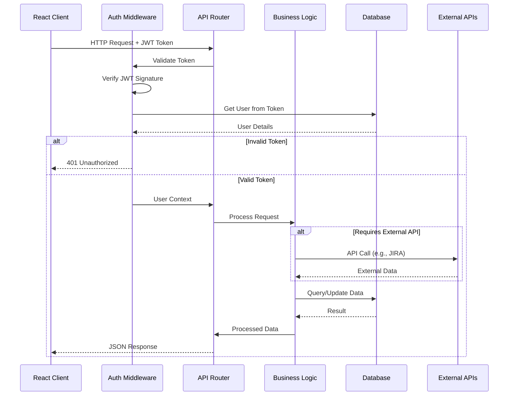

## Authentication Flow

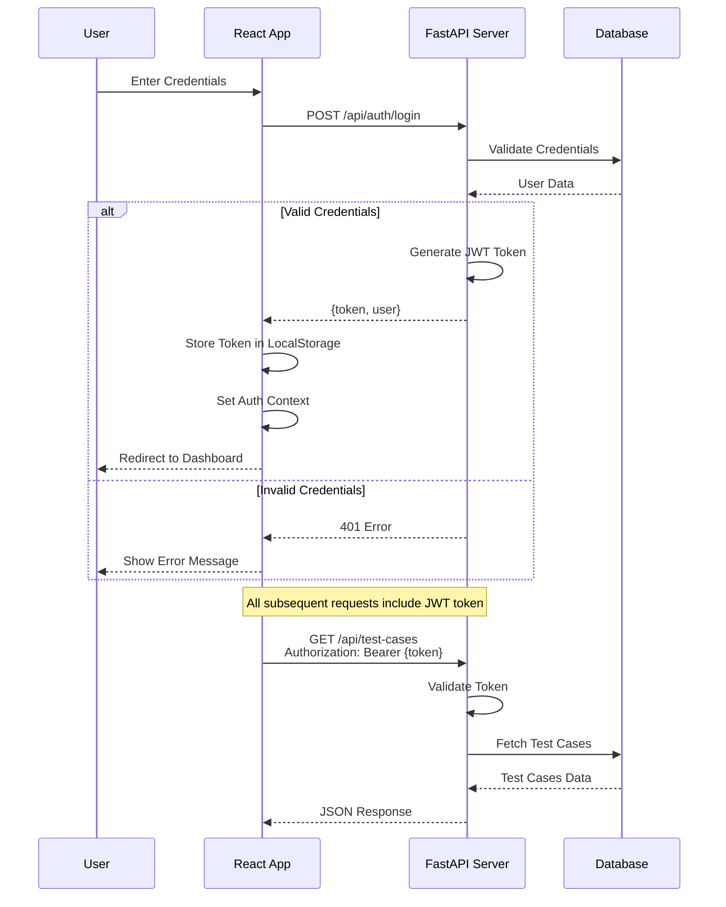

## API Endpoint Details

### Authentication Endpoints

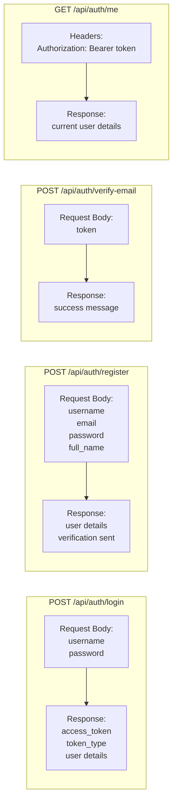

### Test Cases Endpoints

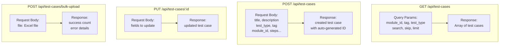

### JIRA Stories Endpoints

```mermaid
graph TB
    subgraph "POST /api/jira-stories"
        CreateStoryReq[Request Body:<br/>jira_url]
        FetchJira[Fetch from JIRA API]
        ParseStory[Parse Story Details]
        SaveDB[Save to Database]
        CreateStoryResp[Response:<br/>story details]
        
        CreateStoryReq --> FetchJira
        FetchJira --> ParseStory
        ParseStory --> SaveDB
        SaveDB --> CreateStoryResp
    end
    
    subgraph "POST /jira-stories/:id/link-test-case/:tcId"
        LinkReq[Path Params:<br/>story_id, test_case_id]
        CheckExists[Check Existing Link]
        CreateJunction[Create Junction Record]
        UpdateCount[Update Test Count]
        LinkResp[Response:<br/>success message]
        
        LinkReq --> CheckExists
        CheckExists --> CreateJunction
        CreateJunction --> UpdateCount
        UpdateCount --> LinkResp
    end
    
    subgraph "GET /jira-stories/:id/test-cases"
        GetTestsReq[Path Params:<br/>story_id]
        QueryJunction[Query Junction Table]
        FetchTests[Fetch Test Details]
        GetTestsResp[Response:<br/>array of linked tests]
        
        GetTestsReq --> QueryJunction
        QueryJunction --> FetchTests
        FetchTests --> GetTestsResp
    end
```

### Release Management Endpoints

```mermaid
graph TB
    subgraph "POST /api/releases"
        CreateRelReq[Request Body:<br/>version<br/>release_date<br/>status]
        CreateRelResp[Response:<br/>created release]
        CreateRelReq --> CreateRelResp
    end
    
    subgraph "POST /api/releases/:id/test-cases"
        AddTCReq[Request Body:<br/>test_case_ids array<br/>module_id<br/>sub_module_id<br/>feature_id]
        ValidateIDs[Validate Test Case IDs]
        CreateLinks[Create Release Links]
        AddTCResp[Response:<br/>success count]
        
        AddTCReq --> ValidateIDs
        ValidateIDs --> CreateLinks
        CreateLinks --> AddTCResp
    end
    
    subgraph "PUT /releases/:id/test-cases/:tcId"
        UpdateExecReq[Request Body:<br/>execution_status<br/>comments<br/>bug_id]
        UpdateRel[Update Execution Record]
        UpdateExecResp[Response:<br/>updated record]
        
        UpdateExecReq --> UpdateRel
        UpdateRel --> UpdateExecResp
    end
    
    subgraph "GET /api/reports/releases/:id/summary"
        SummaryReq[Path Params:<br/>release_id]
        AggregateData[Aggregate Test Data]
        CalcMetrics[Calculate Metrics]
        BuildCharts[Build Chart Data]
        SummaryResp[Response:<br/>complete summary<br/>charts, modules, tests]
        
        SummaryReq --> AggregateData
        AggregateData --> CalcMetrics
        CalcMetrics --> BuildCharts
        BuildCharts --> SummaryResp
    end
```

## API Error Handling

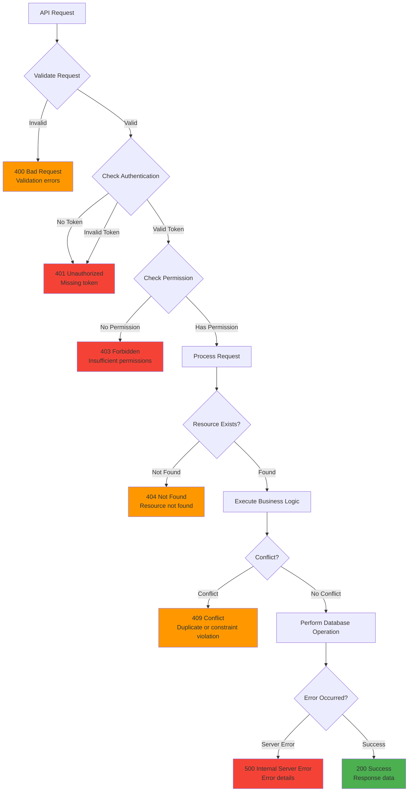

## API Rate Limiting & Caching (Future)

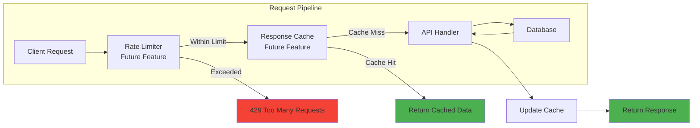

## WebSocket Support (Future Enhancement)

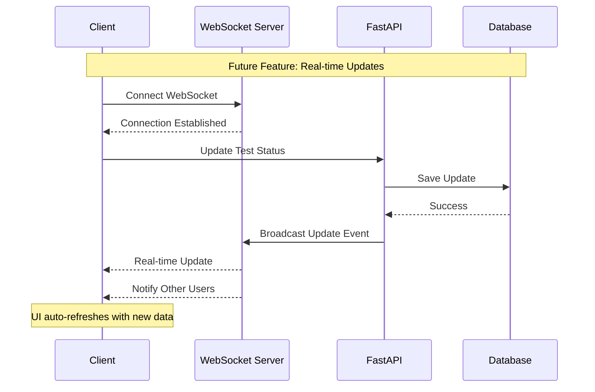

## API Documentation Auto-Generation

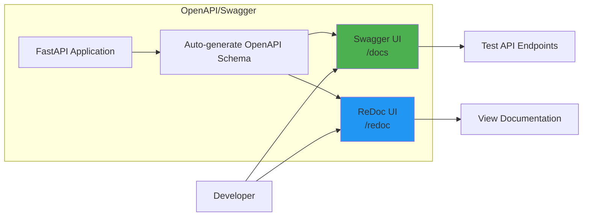
