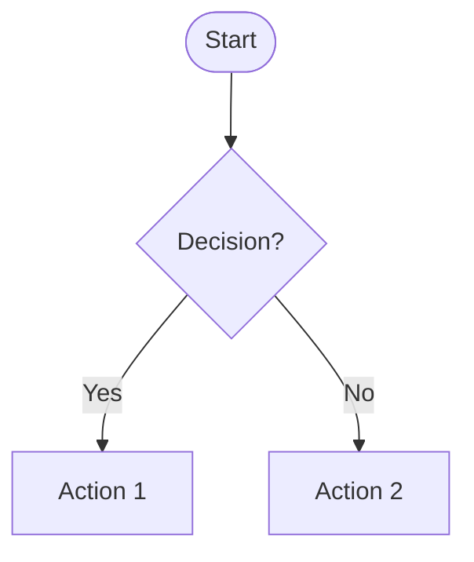

# Diagrams Index

This folder contains comprehensive Mermaid diagrams documenting the Centime Platform Testing Suite architecture, flows, and interactions.

## Available Diagrams

### 1. [System Architecture](./01_SYSTEM_ARCHITECTURE.md)
Complete system architecture showing all layers and components:
- **High-Level Architecture**: Frontend, Backend, Database layers
- **Technology Stack**: Detailed tech stack for each layer
- **Deployment Architecture**: Development and production environments
- **Data Flow**: Request/response flow between components
- **Security Architecture**: Authentication and authorization flow
- **Component Communication**: How components interact

### 2. [Feature Flows](./02_FEATURE_FLOWS.md)
Detailed flowcharts for all major features:
- **Test Case Creation Flow**: Manual and automated test creation
- **Test Design Studio Flow**: Gherkin/BDD workflow
- **Release Management Flow**: Complete release lifecycle
- **JIRA Stories Integration**: Story linking and management
- **Module Management**: Hierarchical module structure
- **Report Generation**: PDF report creation process

### 3. [Database Schema](./03_DATABASE_SCHEMA.md)
Complete database design and relationships:
- **Entity Relationship Diagram**: All tables and relationships
- **Core Tables Detail**: Users, Test Cases, Modules
- **Many-to-Many Relationships**: Junction tables explained
- **Module Hierarchy**: Three-tier structure visualization
- **Release Management Schema**: Release tracking tables
- **BDD/Gherkin Schema**: Step catalog and feature files
- **Indexes and Performance**: Database optimization
- **Migration History**: Schema evolution timeline

### 4. [User Journeys](./04_USER_JOURNEYS.md)
User-centric flowcharts showing real-world usage:
- **SDET Journey**: Daily workflow for test engineers
- **Test Manager Journey**: Release planning and tracking
- **Developer Journey**: Bug fixing and story completion
- **New User Onboarding**: First-time user experience
- **Test Case Creation**: Detailed creation process
- **Release Execution**: Complete testing workflow
- **JIRA Integration**: Story linking journey
- **Report Generation**: Report creation and sharing

### 5. [API Architecture](./05_API_ARCHITECTURE.md)
Complete API documentation and structure:
- **API Endpoint Map**: All available endpoints
- **Request/Response Flow**: API call lifecycle
- **Authentication Flow**: JWT token flow
- **Endpoint Details**: Request/response schemas
- **Error Handling**: Error codes and responses
- **Future Enhancements**: Rate limiting, caching, WebSockets

## How to View These Diagrams

### In GitHub
All Mermaid diagrams render automatically in GitHub's markdown viewer. Simply click on any of the diagram files above.

### In VS Code
Install the **Mermaid Preview** extension:
1. Open VS Code Extensions (Cmd/Ctrl + Shift + X)
2. Search for "Mermaid Preview"
3. Install the extension
4. Open any .md file and use the preview pane

Recommended extensions:
- **Markdown Preview Mermaid Support** by Matt Bierner
- **Mermaid Markdown Syntax Highlighting** by Bpruitt-goddard

### Online Viewers
Copy and paste the Mermaid code into:
- [Mermaid Live Editor](https://mermaid.live/)
- [Mermaid Chart](https://www.mermaidchart.com/)

### Exporting to Images
Using Mermaid CLI:
```bash
# Install mermaid-cli
npm install -g @mermaid-js/mermaid-cli

# Convert to PNG
mmdc -i diagram.md -o diagram.png

# Convert to SVG
mmdc -i diagram.md -o diagram.svg
```

## Diagram Types Used

### Flowcharts
Used for process flows and decision trees:


### Sequence Diagrams
Used for API interactions and time-based flows:


### Entity Relationship Diagrams
Used for database schema:


### Graph Diagrams
Used for architecture and component relationships:


### Journey Diagrams
Used for user experience flows:


## Diagram Conventions

### Color Coding
- 🟢 **Green (#4caf50)**: Start points, success states, completed actions
- 🔵 **Blue (#2196f3)**: Main processes, primary components
- 🟠 **Orange (#ff9800)**: Warning states, intermediate steps
- 🔴 **Red (#f44336)**: Error states, critical components
- 🟣 **Purple (#9c27b0)**: Special features, analytics
- ⚫ **Gray (#757575)**: Cancelled/neutral states

### Node Shapes
- `([Start/End])`: Rounded stadium shape for start/end points
- `[Action]`: Rectangle for actions and processes
- `{Decision?}`: Diamond for decision points
- `((Database))`: Cylinder for databases
- `[/Input/]`: Parallelogram for input/output

### Arrow Styles
- `-->`: Standard flow
- `-.->`: Optional or conditional flow
- `==>`: Strong relationship or emphasis
- `-->>`: Return or response flow

## Contributing to Diagrams

To update or add diagrams:

1. **Follow Existing Patterns**: Use the same structure as existing diagrams
2. **Use Color Conventions**: Stick to the color scheme above
3. **Add Comments**: Include explanatory text where needed
4. **Test Rendering**: Verify diagrams render correctly in GitHub
5. **Update Index**: Add new diagrams to this README

### Example Diagram Template
```markdown
## Feature Name


## Related Documentation

- [Platform Overview](../docs/PLATFORM_OVERVIEW.md)
- [API Documentation](../docs/API_DOCUMENTATION.md)
- [Setup Guide](../docs/SETUP_GUIDE.md)
- [Technical Presentation](../docs/TECHNICAL_PRESENTATION.md)

## Feedback

For questions or suggestions about these diagrams, please contact the development team or open an issue in the repository.

---

*Last Updated: November 17, 2025*
