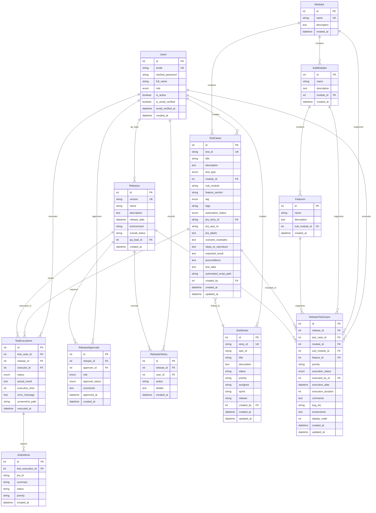
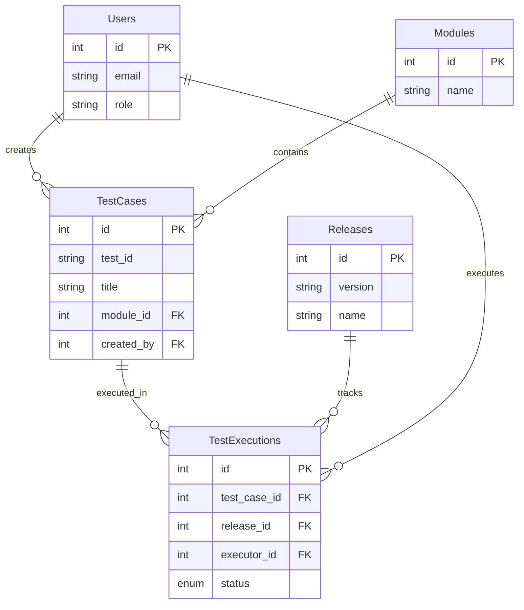
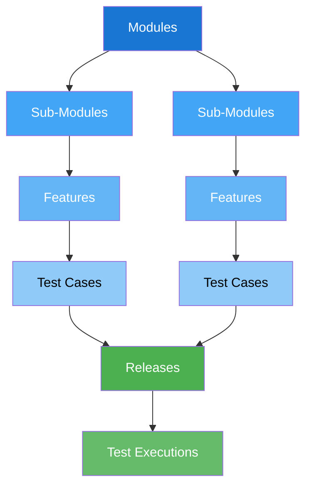
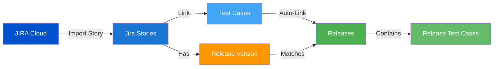
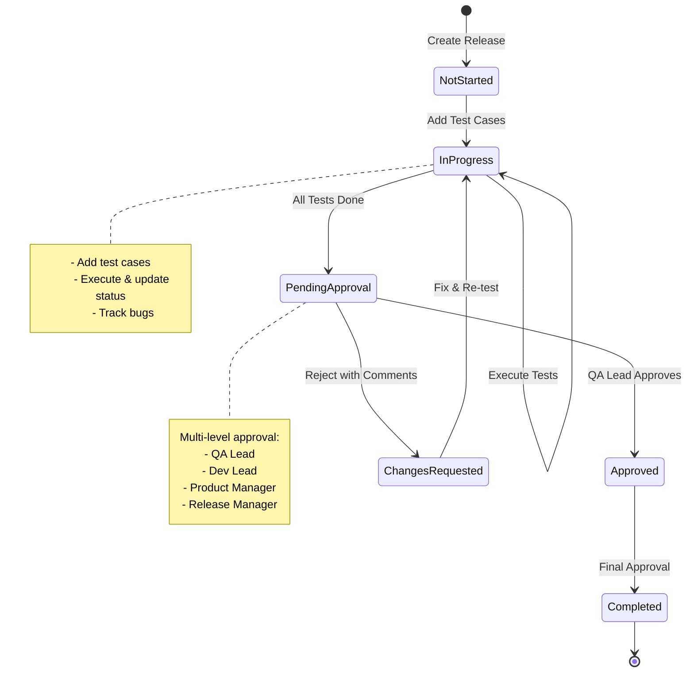
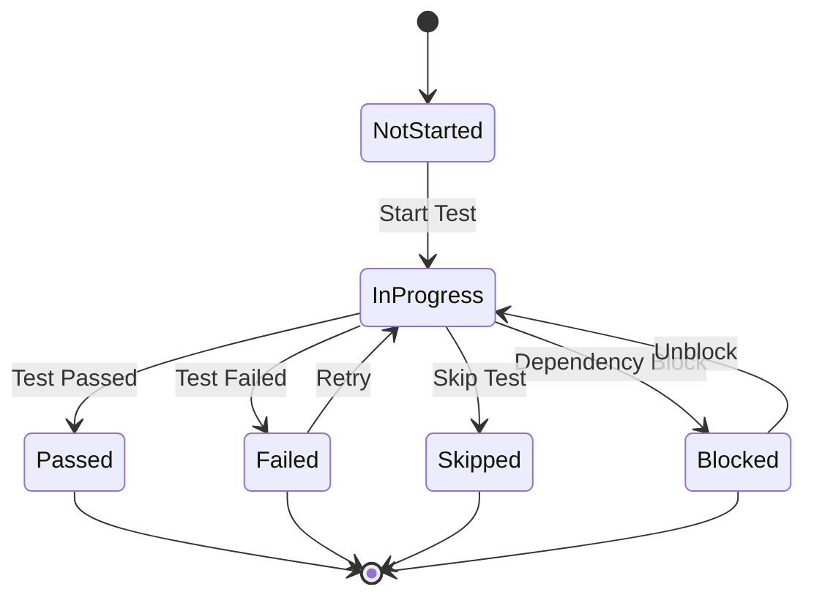
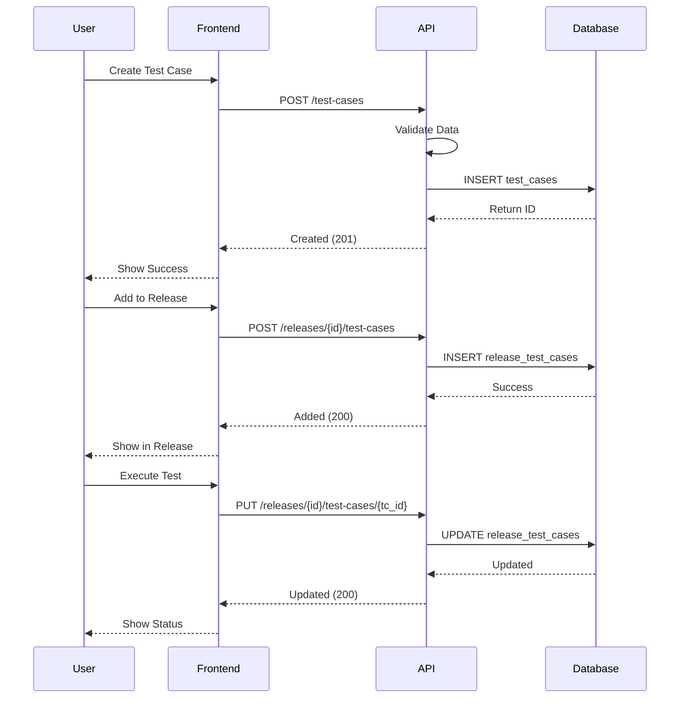
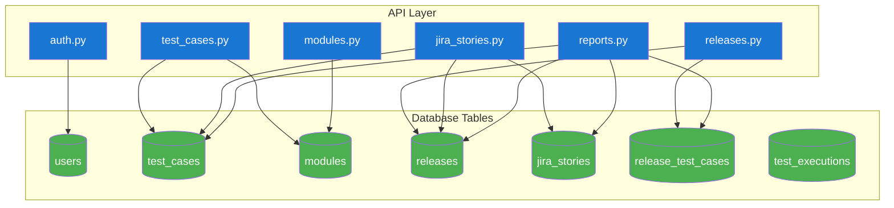

# Database Schema Diagram

This file contains Mermaid diagrams that can be rendered in GitHub, VS Code (with Mermaid extension), or online tools like mermaid.live

---

## Complete Entity Relationship Diagram



---

## Core Entities Only (Simplified View)



---

## Test Organization Hierarchy



---

## JIRA Integration Flow



---

## Release Management Workflow



---

## Test Execution States



---

## Data Flow: Test Case Creation to Execution



---

## API to Database Mapping



---

## How to Use These Diagrams

### Option 1: View in GitHub
- Push this file to GitHub
- GitHub automatically renders Mermaid diagrams

### Option 2: VS Code
- Install "Markdown Preview Mermaid Support" extension
- Open this file and preview (Cmd/Ctrl + Shift + V)

### Option 3: Online Tools
- Visit https://mermaid.live/
- Copy diagram code and paste
- Export as PNG/SVG for presentations

### Option 4: Convert to Images
```bash
# Install mermaid-cli
npm install -g @mermaid-js/mermaid-cli

# Convert to PNG
mmdc -i DATABASE_SCHEMA_DIAGRAM.md -o schema.png

# Convert to SVG
mmdc -i DATABASE_SCHEMA_DIAGRAM.md -o schema.svg
```
